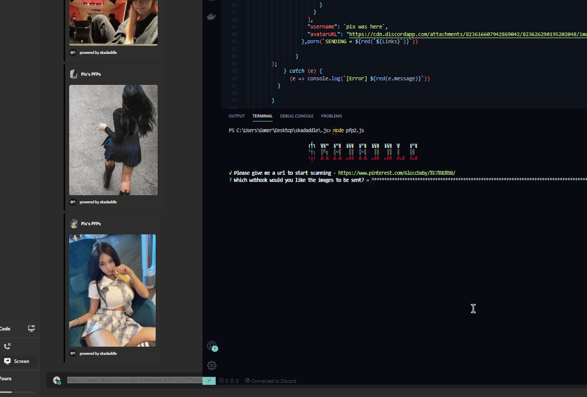

# Discord-PFP-Scraper

Just a scrapper that searches pictures in websites and uploades it to a webhook, great for ppl with pfp servers and are trying to fill em up quick.

# leave the footer as creds yes i am talking to u @skids 🙄
# Tested Sites
```Nim
1. [Supported] Pintrest [Gifs Won't Work]
2. [Supported] WeHeartIt [ some what buggy / gifs don't work]
3. [Not Supported] giphy [link redirects to first pic]
4. [Supported] Tenor [works with gifs]
5. [Supported] davidbaptistechirot.blogspot.com [works great for gifs]
dm eozri#0070 if u find other websites that support either gif or png/jpg yk 
```
# What You Need
```
npm i cherio 
```
```
npm i ora  
```
```
npm i chalk  
```
```
npm i request  
```
```
npm i enquirer
```
# What It Looks Like in action
```Nim
just do node pfp2.js or u can rename it to index.js and make a .bat in the .bat put node .
```

